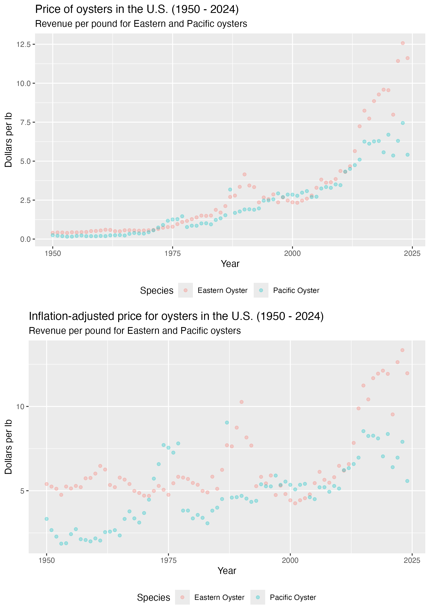

# U.S. Oyster Landings 1950-2024 and Imports []

By: Jorge Schmidt

# Overview

This repository contains data and code to build a dataset of landings of 
multiple species of oysters in the U.S. from 1950 to 2024, inclusive, and of 
imports of fresh (wild and farmed) oysters from [?] to 2024, inclusive, and 
calculates weighed-average inflation-adjusted prices. 

It is intended to support feasibility analyses for potential oyster farms on 
the U.S. mainland.

# 

The final data files [ep_oysters_inflation_adjusted and 
fl_oysters_inflation_adjusted ] combine information from the files 
FOSS_landings.xlsx, ANNUAL TRADE-NO AGGREGATION_.xlsx, and CPIAUCSL.csv.

## The analysis is meant to:
 - 1. describe historical trends (volume and pricing) in U.S. landings of fresh oysters (eastern and pacific);
 - 2. describe historical trends (volume and pricing) in imports of fresh oysters (farmed and wild); and
 - 3. analyze historical inflation-adjusted pricing.

# About the data
data/processed/landings_by_year contains 150 rows and 4 columns.

 - year -          Numeric - the year of the observation, from 1950 through 2024, 

 - total_pounds -  Numeric - total landings in pounds of meat for a given species in a 
                given year (excludes shells).
 - total_dollars - Numeric - total farmgate revenues of the landings for a given 
                species in a given year.
                
                

data/processed/cpi_1940_2024_by_yr contains 75 rows and 2 columns.

 - year -          Numeric - the year of the observation, from 1950 through 2024, 
                inclusive.
 - avg_cpi -       Numeric - the average consumer price index for a year.

data/output/ep_oysters_inflation_adjusted contains 150 rows and 6 columns.

 - year -          Numeric - the year of the observation, from 1950 through 2024, 
                inclusive.
 - species -       Character - indicates the species. The options are 
                "OYSTER, PACIFIC" and "OYSTER, EASTERN."
 - total_pounds -  Numeric - total landings in pounds for a given species in a 
                given year.
 - total_dollars - Numeric - total farmgate revenues of the landings for a given 
                species in a given year.
 - avg_cpi -       Numeric - the average consumer price index for a year.
 - adj_dollars -   Numeric - the inflation-adjusted price per pound for landings of
                a given species in a given year.

data/output/fl_oysters_inflation_adjusted contains 150 rows and 6 columns.

 - year -          Numeric - the year of the observation, from 1950 through 2024, 
                inclusive.
 - coast -         Character - indicates the coast. The options are 
                "FLORIDA-EAST" and "FLORIDA-WEST."
 - total_pounds -  Numeric - total landings in pounds for a given species in a 
                given year.
 - total_dollars - Numeric - total farmgate revenues of the landings for a given 
                species in a given year.
 - avg_cpi -       Numeric - the average consumer price index for a year.
 - adj_dollars -   Numeric - the inflation-adjusted price per pound for landings of
                a given species in a given year.

# The repository contains three main folders:

## data:
### data/raw contains:
 - The landings data [FOSS_landings.xlsx] was obtained from
 https://www.fisheries.noaa.gov/foss/f?p=215:200:7482903932446

 - The inflation data [CPIAUCSL.csv] was obtained from
https://fred.stlouisfed.org/series/CPIAUCSL

  - The imports data [ANNUAL TRADE-NO AGGREGATION_.xlsx] was obtained from
https://www.fisheries.noaa.gov/foss/f?p=215:2:6766915422114

### data/processed contains three files that are the cleaned up and filtered version of the raw data:
 - production_by_year_ep.rds contains the nationwide data for eastern and pacific oysters;
 - production_by_year_fl.rds contains the florida data for its eastern and weatern coasts; and
 - cpi_1950_2024_by_yr.rds contains the annualized cpi data.

### data/output contains two files that are the result of the analyses:
 - ep_oysters_inflation_adjusted.rds contains the combined nationwide landings and cpi data necessary to calculate inflation-adjusted prices
 - fl_oysters_inflation_adjusted.rds contains the combined Florida landings and cpi data necessary to calculate inflation-adjusted prices

## scripts
 - scripts/01_processing contains two scripts that read the raw data, cleans it up, and exports processed data.

 - scripts/02_analyses contains two scripts: one calculates inflation-adjusted yearly prices for Eastern and Pacific Oysters, and the other calculates inflation-adjusted yearly prices for landings in Florida's east and west coasts.

 - scripts/03_contents contains a single script that builds eight figures.

## results
### results/img contains seven images displaying 
 - 1. T

change size price by volume
explain conversion whole to meat factor

