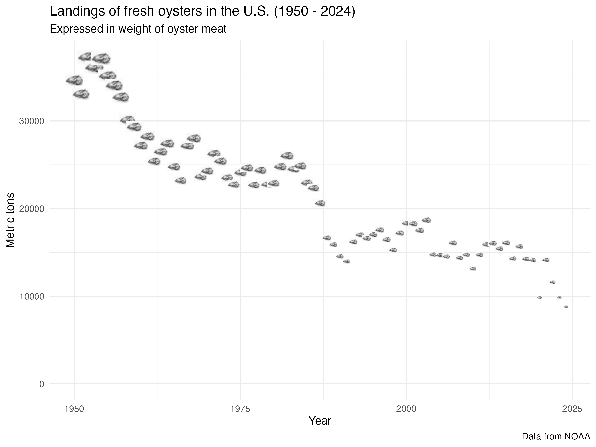
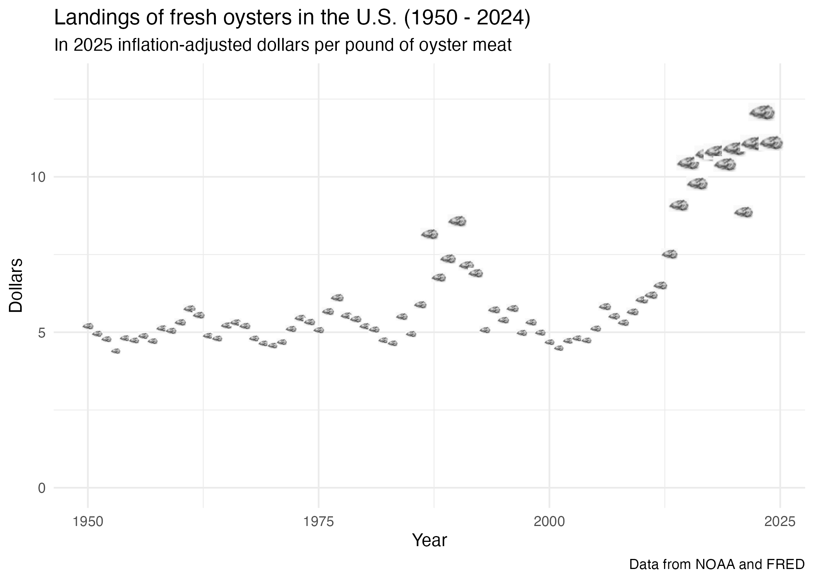
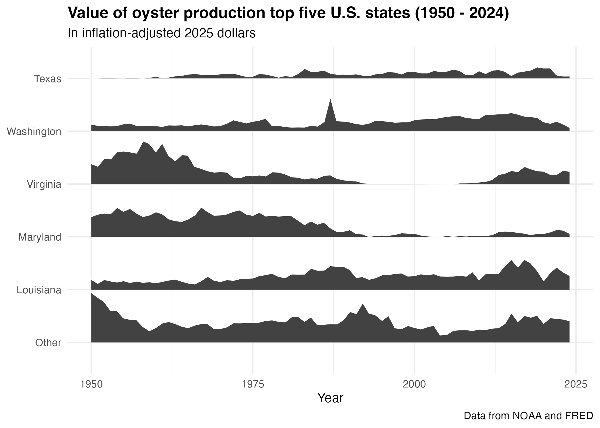

# U.S. Oyster Landings 1950 - 2024

By: Jorge Schmidt

# Overview

This repository contains data and code to build a dataset of landings of fresh 
oysters from 1950 to 2024, inclusive, and calculates weighed-average 
inflation-adjusted prices for oyster meat during that timeframe. It is intended to support decision-making in the
oyster production and distribution sectors by displaying trends in volumes 
and prices. 

A full report can be found here: https://htmlpreview.github.io/?https://github.com/TheJorgeSchmidt/oysters/blob/main/final_report.html

## The analysis is meant to:
1. describe historical trends (volume and pricing) in U.S. landings of fresh oysters;
2. analyze historical inflation-adjusted pricing; and
3. highlight the leading oyster-producing states.

# The repository contains three main folders:

## data:
### data/raw contains:
- The landings data [FOSS_landings.xlsx] was obtained from
 https://www.fisheries.noaa.gov/foss/f?p=215:200:7482903932446

- The inflation data [CPIAUCSL.csv] was obtained from
https://fred.stlouisfed.org/series/CPIAUCSL

- An oyster image used for visualizations. 

### data/processed contains four files that are the cleaned up and filtered version of the raw data:
- landings_by_year.rds contains aggregate nationwide data;
- landings_by_state.rds contains total production by state;
- landings_clean.rds contains yearly production and value data per state;
- cpi_by_yr.rds contains the annualized cpi data; and
- oyster_resized.png is an oyster image.

### data/output contains two files that are the result of the analyses:
- landings_inflation_adjusted.rds contains the combined nationwide landings and cpi data necessary to calculate inflation-adjusted prices
- landings_by_top_state_inflation_adjusted.rds contains the volume and inflation-adjusted value of production for the top five U.S. states

## Scripts:
- scripts/01_processing contains four scripts that read the raw data, cleans it up, and exports processed data.
- scripts/02_analyses contains a script that calculates inflation-adjusted yearly prices for oyster landings.
- scripts/03_contents contains a script that builds and exports three plots, and one that creates and exports a spatial visualization.

## Results:
- the results are found in the /img folder which contains four visualizations

