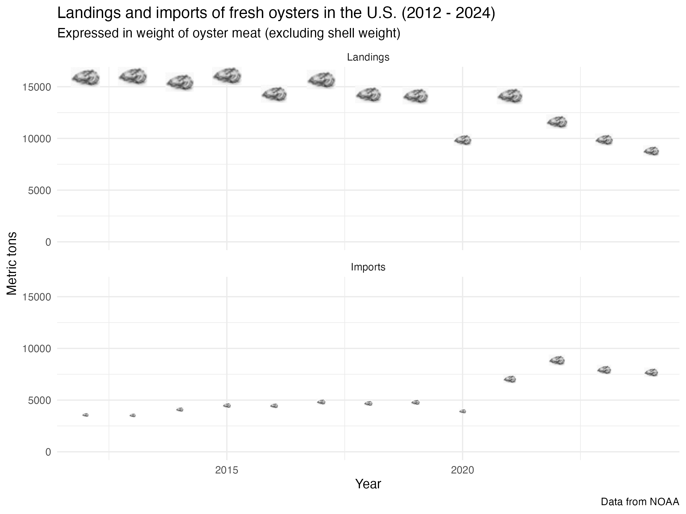
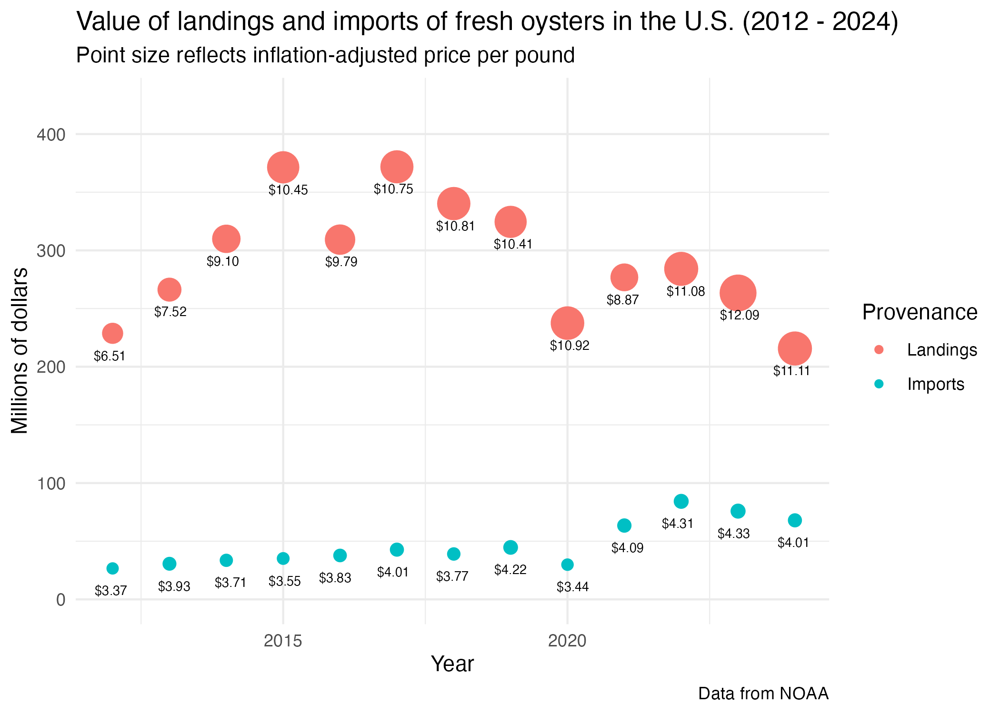

# U.S. Oyster Landings 1950 - 2024

By: Jorge Schmidt

# Overview

This repository contains data and code to build a dataset of landings of fresh 
oysters from 1950 to 2024, inclusive, and calculates weighed-average 
inflation-adjusted prices. It is intended to support feasibility analyses for
potential oyster farms on the U.S. mainland.

# 
# 

The final data files [data/processed/landings_by_year.rds,  
data/processed/imports_by_year.rds, and data/processed/cpi_by_year.rds] contain
information from the files FOSS_landings.xlsx, ANNUAL TRADE-NO AGGREGATION_.xlsx, 
and CPIAUCSL.csv.

## The analysis is meant to:
 - 1. describe historical trends (volume and pricing) in U.S. landings of fresh oysters;
 - 2. describe historical trends (volume and pricing) in imports of fresh oysters; and
 - 3. analyze historical inflation-adjusted pricing.

# About the data
data/processed/landings_by_year.rds contains 75 rows and 3 columns.

 - year -          Numeric - the year of the observation, from 1950 through 2024, 

 - total_pounds -  Numeric - total landings in pounds of meat for a 
                given year (excludes shells).
 - total_dollars - Numeric - total farmgate revenues of the landings for a given 
                 year.
                

data/processed/imports_by_year.rds contains 13 rows and 3 columns.

- year -          Numeric - the year of the observation, from 2012 through 2024, 

 - total_pounds -  Numeric - total imports in pounds of meat for a 
                given year (excludes shells).
                
 - total_dollars - Numeric - total declared value of the imports for a given 
                 year.
                 
                 
data/processed/cpi_by_yr,rds contains 75 rows and 2 columns.

 - year -          Numeric - the year of the observation, from 1950 through 2024, 
                inclusive.
 - avg_cpi -       Numeric - the average consumer price index for a year.

# The repository contains three main folders:

## data:
### data/raw contains:
 - The landings data [FOSS_landings.xlsx] was obtained from
 https://www.fisheries.noaa.gov/foss/f?p=215:200:7482903932446

 - The inflation data [CPIAUCSL.csv] was obtained from
https://fred.stlouisfed.org/series/CPIAUCSL

  - The imports data [ANNUAL TRADE-NO AGGREGATION_.xlsx] was obtained from
https://www.fisheries.noaa.gov/foss/f?p=215:2:6766915422114

### data/processed contains three files that are the cleaned up and filtered version of the raw data:
 - landings_by_year.rds contains the nationwide data for 1950 - 2024;
 - imports_by_year.rds contains the import data for 2012 - 2014; and
 - cpi_by_yr.rds contains the annualized cpi data from 1950 - 2024.

### data/output contains two files that are the result of the analyses:
 - landings_inflation_adjusted.rds contains the combined nationwide landings and cpi data necessary to calculate inflation-adjusted prices
 - imports_inflation_adjusted.rds contains the imports and cpi data necessary to calculate inflation-adjusted prices

## scripts
 - scripts/01_processing contains three scripts that read the raw data, cleans it up, and exports processed data.

 - scripts/02_analyses contains two scripts: one calculates inflation-adjusted yearly prices for oyster landings, and the other calculates inflation-adjusted yearly prices for oyster imports.

 - scripts/03_contents contains a single script that builds two figures.

## results
### results/img contains two images displaying 
 - 1. Landings and imports of fresh oysters by weight (2012 - 2024)
 - 2. Value in inflation-adjusted dollars of landings and imports (2012 - 2024)

